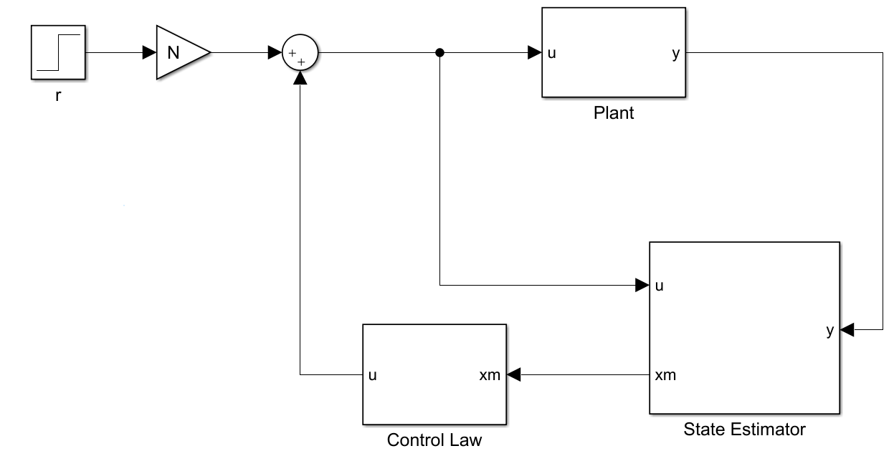
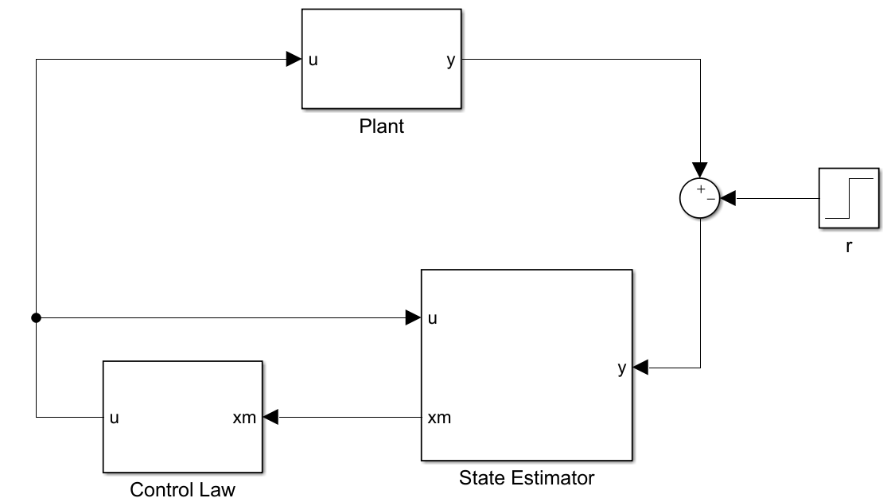
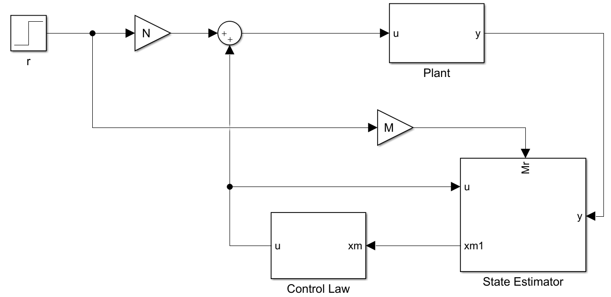

现代控制基础（5）：参考的引入
==========================================

调节器只能将系统的各状态拉回到零位，而控制系统的根本目的是使被控对象的输出跟随参考信号，因此在调节器设计完成的基础上，还需要正确地引入参考信号。

设被控对象的状态空间方程为

.. math::
    \left\{
    \begin{aligned}
    \dot{\mathbf{x}} &= A \mathbf{x} + Bu  \\
    y &= C \mathbf{x}
    \end{aligned}
    \right.

在实际的数字控制系统中，能够人为干涉的是状态的估计和控制律，因此，不失一般性地可以设参考信号 :math:`r` 的引入方式为

.. math::
   \left\{ \begin{aligned}
      \dot{\hat{\mathbf{x}}} &= \left( {{A} - {LC} - {BK}} \right) \hat{\bf x} + {L}y + {M}r \\
      u &=  - K {\hat{\bf x}} + Nr
   \end{aligned} \right.

参数 :math:`M` 和 :math:`N` 的设计方法可分为如下三种情况。

标准形式
--------------------------------------------------

从状态观测器的角度来考察，不希望参考信号的引入对状态估计产生影响，考察状态估计的误差为

.. math::

   \dot{\tilde{\mathbf{x}}} &= {A\mathbf{x}} + {B}\left( { - K{\hat{\bf x}} + Nr} \right) - \left[ {\left( {{A} - {LC} - {BK}} \right){\bf{\hat x}} + {L}y + {M}r} \right] \\
   &= \left( {{A} - {LC}} \right){\bf{\tilde x}} + \left( {{B}N - {M}} \right)r

因此，通过补充约束条件： :math:`M =  BN` ，即可避免参考信号对状态估计引入任何扰动。

此时，控制器的状态空间可以进一步改写为

.. math::

   \left\{ {\begin{array}{*{20}{l}}
   {{\bf{\dot{\hat x}}} = \left( {{A} - {LC}} \right){\bf{\hat x}} + {B}u + {L}y}\\
   {u =  - K{\hat{\bf x}} + Nr}
   \end{array}} \right.

这就意味着状态观测器的输入与被控对象完全一致。这时，只需要对参考信号的增益 :math:`N` 进行设计，设计的原则是令 :math:`r\rightarrow y` 的增益为 :math:`1` 即可。考察闭环系统的状态空间

.. math::

   \left\{ \begin{aligned}
   \begin{bmatrix}
   {{\bf{\dot{x}}}}\\
   {{\bf{\dot{\tilde x}}}}
   \end{bmatrix} &= \begin{bmatrix}
   {{A} - {BK}}&{{BK}}\\
   {0}&{{A} - {LC}}
   \end{bmatrix}\begin{bmatrix}
   {\bf{x}}\\
   {{\bf{\tilde x}}}
   \end{bmatrix}+ \begin{bmatrix}
   {B}\\
   {0}
   \end{bmatrix}Nr \\
   y &= \begin{bmatrix}
   {C}&0
   \end{bmatrix} \begin{bmatrix}
   {\bf{x}}\\
   {{\bf{\tilde x}}}
   \end{bmatrix}
   \end{aligned} \right.

根据 :math:`r\rightarrow y` 的增益为 :math:`1` 解得

.. math::

    N =  - {\left\{ {\left[ {\begin{array}{*{20}{c}}
   {C}&0
   \end{array}} \right]{{\left[ {\begin{array}{*{20}{c}}
   {{A} - {BK}}&{{BK}}\\
   {0}&{{A} - {LC}}
   \end{array}} \right]}^{ - 1}}\left[ {\begin{array}{*{20}{c}}
   {B}\\
   {0}
   \end{array}} \right]} \right\}^{ - 1}}

这时整个系统的框图如下图所示。

误差控制
--------------------------------------------------

如果令 :math:`N=0` ， :math:`M = -L` ，即可得到基于误差控制的参考信号引入方式，这是经典控制中的常用方式，如下图所示。

这种简单的方式可以用传递函数来证明其可靠性，设开环传递函数为 :math:`H_{open}` ，则 :math:`r\rightarrow y` 的传递函数即为闭环传递函数

.. math::

   H_{close}=\frac{H_{open}}{1+H_{open}} \rightarrow 1

应当注意，上式成立的条件是 :math:`H_{open}` 在带宽内具有足够的增益，这通常要求开环传递函数中存在一个或多个 :math:`\frac{1}{s}` 项，若被控对象本身无法满足这一条件，可考虑在控制器中增加积分环节。

一般形式
--------------------------------------------------

更一般地，可以通过人为设计参数 :math:`M` 和 :math:`N` 来设计 :math:`r\rightarrow u` 的零点从而改变 :math:`r\rightarrow y` 的零点以改善系统的动态特性。 :math:`r\rightarrow u` 的零点满足（这里关注 :math:`r` ，可以暂时令 :math:`y=0` ）

.. math::

   \begin{gathered}
   \left| {\begin{array}{*{20}{c}}
   {{I}s - \left( {{A} - {BK} - {LC}} \right)}&{ - {M}} \\
   { - {K}}&N
   \end{array}} \right| = 0 \\
   \Downarrow \\
   \left| {{I}s - {A} + {BK} + {LC} - \frac{{M}}{N}{K}} \right| = \left| {{I}s - {A} + {BK} + {LC} - {{\bar MK}}} \right| = 0
   \end{gathered}

因此，我们可以首先根据零点对进行 :math:`{\bar{M}}=\frac{M}{N}` 设计，再根据 :math:`r\rightarrow y` 的增益为 :math:`1` 计算得 :math:`N` 。

这种方式的系统框图如下图所示。

参考资料
--------------------------------------------------

#. G. F. Franklin, J. D. Powell, and A. Emami-Naeini, Feedback Control of Dynamic Systems, 7th ed. Upper Saddle River, NJ, USA: Prentice Hall Press, 2014.

另请参阅： `参考信号仿真测试 <https://github.com/iChunyu/LearnCtrlSys/blob/master/ModernControl/note4_ReferenceInput.mlx>`_

.. 
   Converted from ``Markdown`` to ``reStructuredText`` using pandoc
   Last edited by iChunyu on 2021-04-11