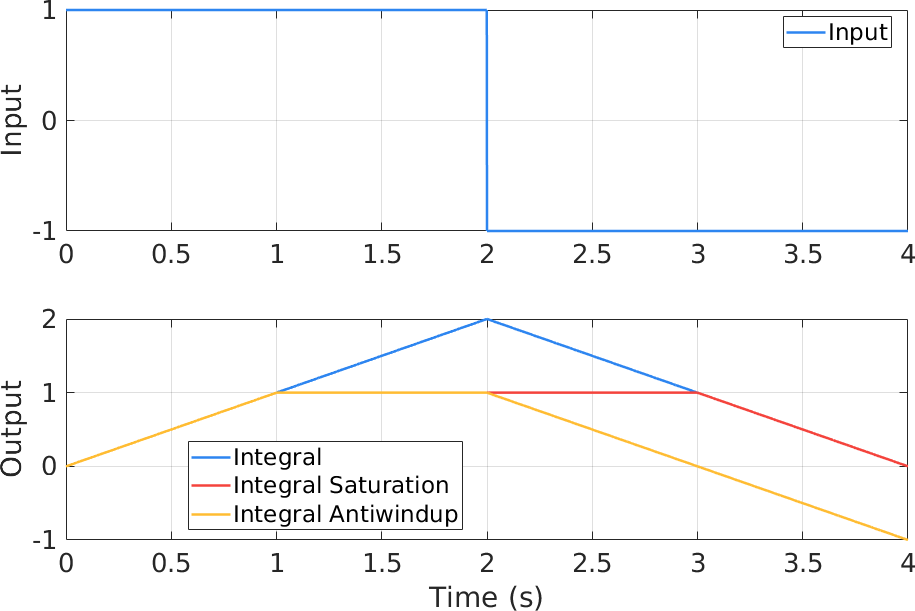
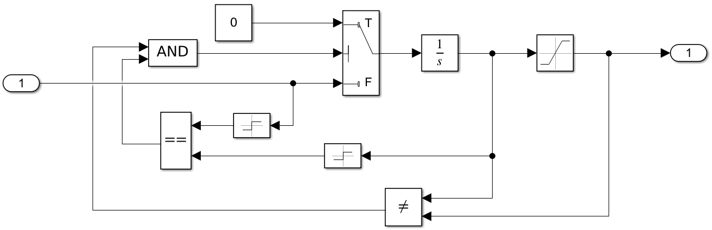
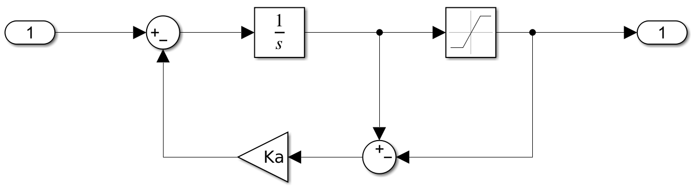
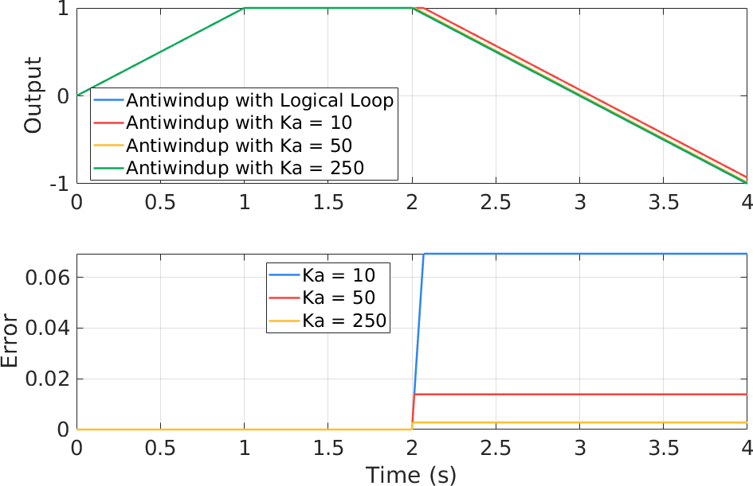
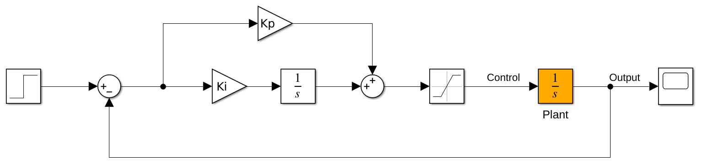

抗饱和积分
==========================================

对于实际的系统，控制器的输出应当受到幅度限制，以避免超出执行机的量程。然而，在具有积分的控制器中如果仅对输出进行限幅，将会引起所谓的退饱和现象，使控制器的性能变差甚至导致系统不稳定。这回我们来谈谈抗饱和积分器。

退饱和现象
------------------------------------------

考察这样一种情形：积分器首先得到正值信号的输入，当积分输出达到限幅后，再经过一段时间，输入变为负值。问：积分器的输出是否会在输入信号变号的那个时刻从限福开始下降？想象一下玩 CSGO 时一直往前走直到顶到墙上，这就对应着积分限幅，这时只要按下后退键，人物立马就会离开墙面。然而遗憾的是，如果像下面这样仅仅对输出进行限幅，实际的输出可能并不会如你所愿。

.. figure:: figures/antiwindup01.png
    :align: center
    :figwidth: 60%

不妨用仿真来看看到底是什么情况：

上面的子图是积分器的输入，在前 2 s 内为正， 2 s 后变为负值。积分器和限幅后的输出分别如下图的蓝色和红色曲线所示。可以看到，这种限幅并没有使输出达到饱和后停止积分，所以内部的积分仍然在持续进行，当输入变号时，积分器的输出立刻开始减小，但是仍然在限幅器的阈值之外，因此输出仍然为饱和值，直到积分减小到限幅以内。红色曲线以上的蓝色曲线下降部分就是我们所说的退饱和现象。这种现象会引起控制器输出的“延时”，为了时积分的输出在输入变号时立刻开始反向积分，需要对积分进行限幅，达到图中黄色曲线的效果。

抗饱和积分器
------------------------------------------

抗饱和积分器的基本思路就是在输出达到饱和时停止积分，实现这一目的最基本的方法就是采用逻辑回路控制积分器的输入，如下图所示：

以这种方式，当积分器的输出达到饱和，且输入与输出同号，则将积分器的输入置零，避免过度积分。除了使用逻辑电路从根本上解决问题外，下面的方式展示了如何利用反馈解决这个问题：

以这种方式，当积分器没有达到饱和时，反馈为零，不影响积分器的正常功能；当积分器达到饱和时，通过一个大的抗饱和增益 :math:`K_a` 进行误差反馈，根据稳定环路下误差趋近于零的条件，可以知道此时积分器的输入几乎为零，积分器近似停止工作。

利用逻辑回路构造的抗饱和积分器是最理想的，但却难以整合在模拟电路中；利用抗饱和增益的反馈虽然具有一定的近似，但很容易在工程中实现。下图展示了这两种方式的对比，随着 :math:`K_a` 的增大，抗饱和反馈的方式会趋近于逻辑回路控制积分器的方式。

积分饱和对控制的影响
------------------------------------------

前面提到过，积分器的退饱和过程相当于对系统引入了不确定的延时，下面以一个例子来简单展示抗饱和积分对控制的影响。假设被控对象为一阶积分器，采用 PI 控制，如图所示：

利用增益的方式对积分器进行抗饱和前后，系统的响应如下：

.. figure:: figures/antiwindup07.png
    :align: center
    :figwidth: 60%

可见，如果不采用抗饱和积分器，控制命令由于退饱和而存在一定延时，导致系统的输出具有较大的超调，并因此而具有较长的收敛时间。唔，实际使用时还是得用抗饱和积分器。

参考资料
------------------------------------------

#. `【中英双字】了解 PID 控制，第 2 部分：超越简单的积分（更新中）MATLAB&Simulink <https://www.bilibili.com/video/BV1Ky4y1g7b9>`_
#. G. F. Franklin, J. D. Powell, A. Emami-Naeini. Feedback Control of Dynamic Systems. 7th ed. 2014. p655-658.

.. XiaoCY 2021-06-19