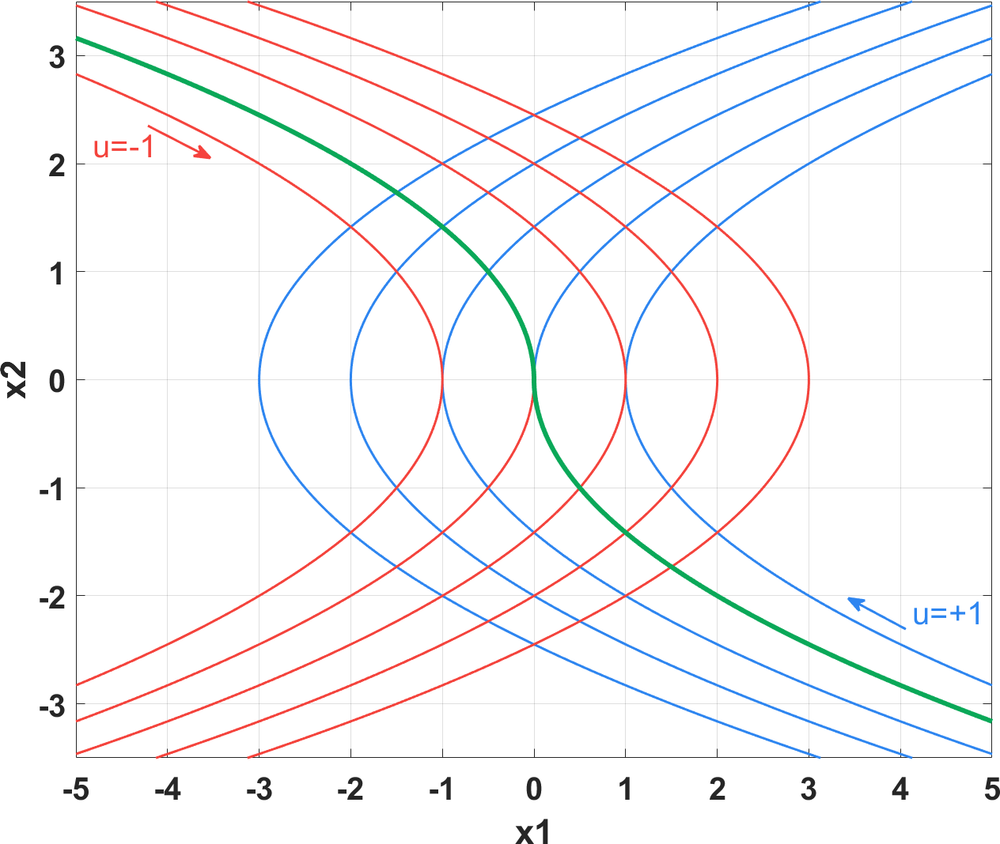
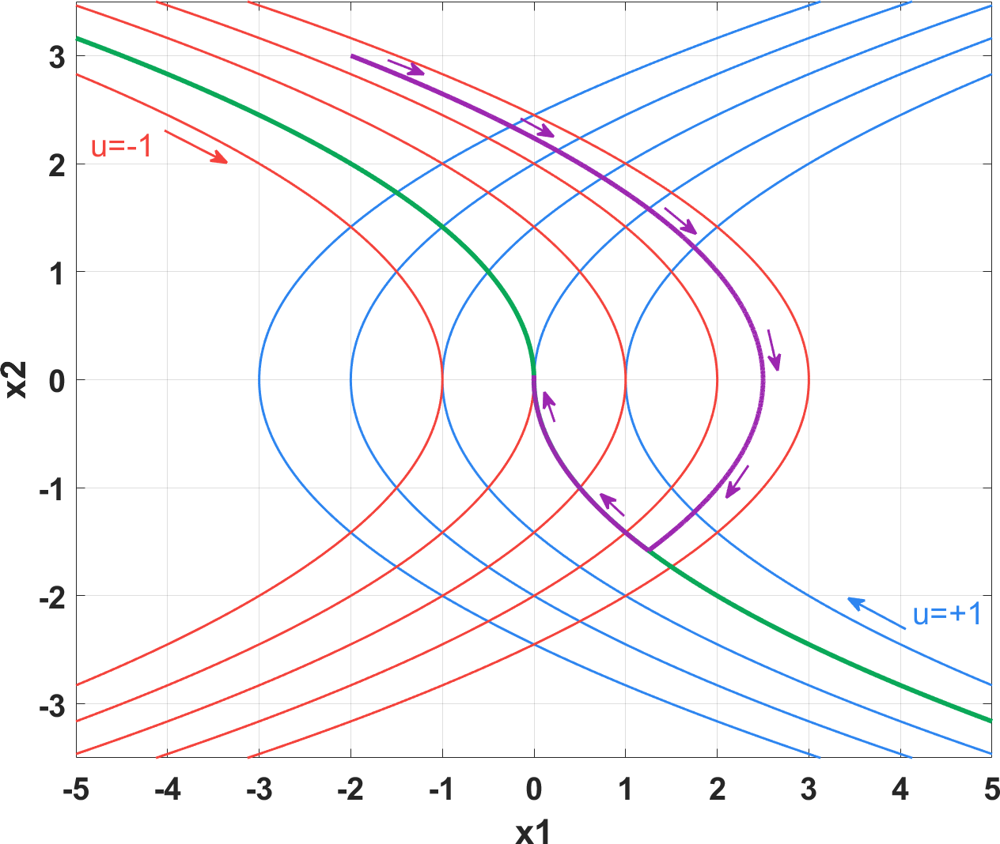
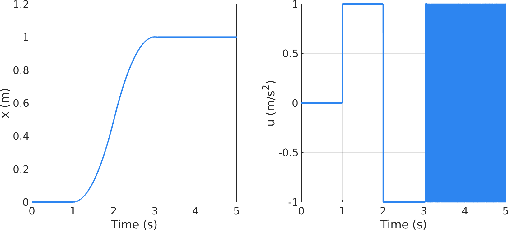

相图与砰砰控制
==========================================

思考这么一个问题：已知起点和目标位置的距离以及运动允许的最大加速度，如何在尽可能短的时间内到达目标且速度为零？显然，应当全力向目标位置加速，并在 *适当的时刻* 全力减速，使得速度减至零的时候恰好停留到目标位置。这实际上是控制中中所说的最速控制，对于二阶系统，为了确定改变的控制命令的 *适当的时刻* ，可以借助相图来完成。

相图（Phase Portrait）
-----------------------------------------

相图也称相轨迹，是以各状态为坐标，由状态轨迹绘制而成的图。例如，质量为 :math:`m` ，刚度为 :math:`K` 弹簧的状态空间方程为

.. math::

    \left\{
    \begin{aligned}
        \dot{x}_1 &= x_2 \\
        \dot{x}_2 &= -\frac{K}{m} x_1 + \frac{1}{m} F
    \end{aligned}
    \right.

当外力 :math:`F=0` ，弹簧从某一初始位置自由释放时，质量块会在平衡位置来回震荡，其相图如下图所示

.. figure:: figures/bangbangctrl01.png
    :figwidth: 60%
    :align: center

相图表示了系统状态随时间的发展趋势，在分析系统动态时非常有用。此外，bilibili 的 up 主 DR_CAN 在他的一期视频里\ `利用相图分析了爱情 <https://www.bilibili.com/video/BV1ex411g7t3>`_\ ，很有意思，有兴趣的朋友可以看一下。

砰砰控制
-----------------------------------------

砰砰控制（Bang Bang Control）又称开关控制，它的控制信号非正即负，与开头提到的要么加速要么减速，因而也称为最速控制。以二阶系统为例，为了确定控制信号（加速度）变号的时刻，考察系统在 :math:`u=u_{\rm max}` 和 :math:`u=-u_{\rm max}` 时的相图，如下图所示（设 :math:`u_{\rm max}=1` ）

图中，蓝色曲线代表在某状态处施加正向最大控制量时系统状态的轨迹，其由第四象限拐向第一象限；红色曲线为施加负向最大控制量时状态的轨迹，由第二象限拐向第三象限。可见，存在一个临界的曲线，如图中绿色曲线所示，当初始状态在该曲线上方时，只要施加负向控制量可使状态回到绿色曲线，反之只要施加正向控制量即可回到绿色曲线。因此这个绿色的曲线就是控制信号的切换曲线 [#fraklin]_ 。

临界曲线的解析式分别对应从原点处分别按 :math:`u = \pm u_{\rm max} = \pm 1` 施加控制所形成的状态轨迹，其表达式为

.. math::

    x_1 + \frac{x_2 |x_2|}{2u_{\rm max}} = 0

因而控制信号可根据当前状态来确定

.. math::

    u = -u_{\rm max} \operatorname{sign}\left( x_1 + \frac{x_2 |x_2|}{2u_{\rm max}} \right)

设系统初始状态 :math:`x_1=-2,\, x_2=3` ，控制过程的状态轨迹如下图紫色曲线所示

理想情况下，控制信号 :math:`u` 最多只需要一次切换就能达到控制效果，而实际的数字控制器中，离散状态的时间间隔限制了状态不可能正好达到相图的原点，状态轨迹会在原点附近出现高频“颤振”，如下图所示。相应地，控制信号不断进行正负切换，就像乒乓球来回碰撞，砰砰控制也因此得名。

    
砰砰控制的高频颤振使其在实际应用中受到限制，为了解决这个问题，韩京清老师基于离散时间模型对控制信号进行了改进，提出了如下算法 [#fhan]_ 。

.. math::

    \mathrm{fhan} = \left\{
        \begin{aligned}
            & a_0 = h x_2   \\
            & d = r h^2     \\ 
            & y = x_1 + a_0     \\
            & a_1 = \sqrt{d \left( d+ 8\left| y \right| \right)}    \\
            & a_2 = a_0 + \operatorname{sign}\left( y \right) \frac{a_1-d}{2}   \\
            & s_y = \frac{1}{2} \left[  \operatorname{sign}\left( y+d \right) - \operatorname{sign}\left( y-d\right)\right]   \\
            & a = \left( a_0 + y - a_2 \right) s_y + a_2 \\
            & s_a = \frac{1}{2} \left[  \operatorname{sign}\left( a+d \right) - \operatorname{sign}\left( a-d\right)\right] \\
            & \mathrm{fhan} = -r \left[ \frac{a}{d} - \operatorname{sign}\left( a \right)\right] s_a - r \operatorname{sign}\left( a \right)
        \end{aligned}\right.

式中， :math:`r=u_{\rm max}` 为控制器输出的最大控制信号，值越大响应越快，闭环的带宽也越大。 :math:`h` 为采样时间，实际使用时可取独立于 :math:`h` 的变量 :math:`h_0 =n h` 以抑制高频噪声，即 :math:`u = \operatorname{fhan}\left( x_1, \, x_2, \, r, \, h_0 \right)` 。采用这种算法，砰砰控制不再出现高频颤振，如下图所示。

.. figure:: figures/bangbangctrl05.png
    :figwidth: 90%
    :align: center

参考资料
-----------------------------------------

.. [#fraklin] G. F. Franklin, J. D. Powell, A. Emami-Naeini. Feedback Control of Dynamic Systems. 7th ed. 2014. p673-676.

.. [#fhan] 韩京清, 自抗扰控制技术: 估计补偿不确定因素的控制技术. 国防工业出版社. 2008. p107.

.. XiaoCY 2021-05-14