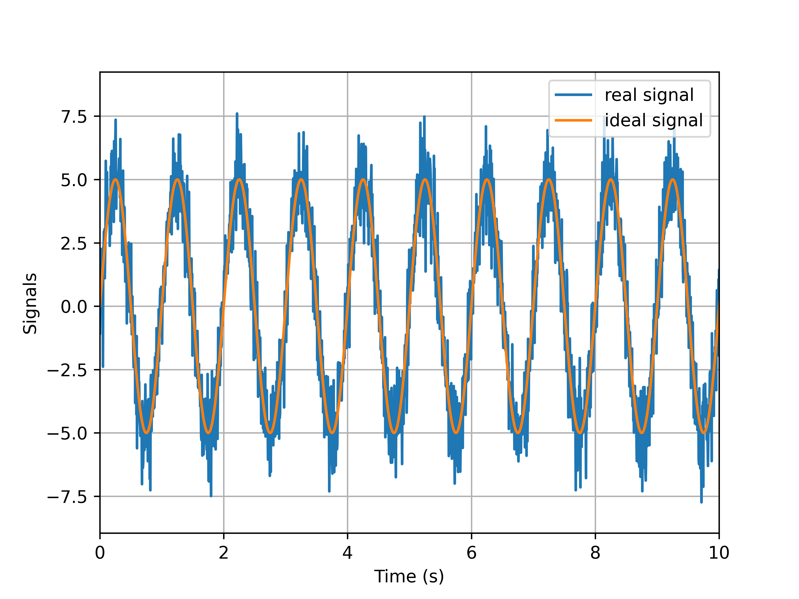
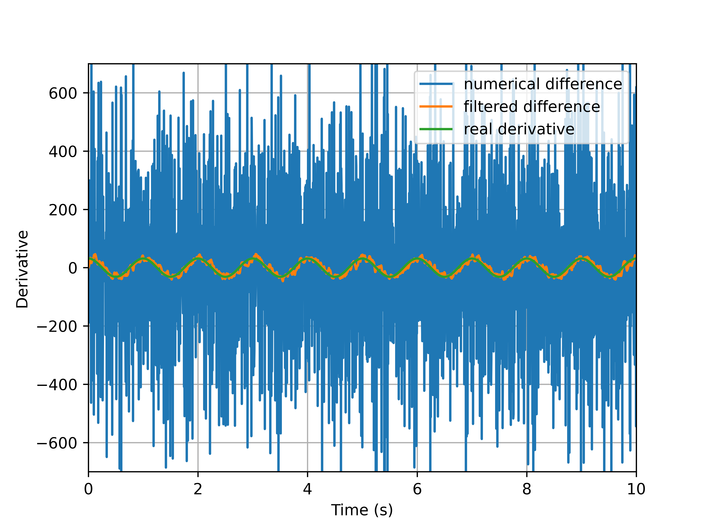

信号的微分
======================================

信号处理中经常会用到微分，典型的例子就是 PID 控制器中的微分环节。然而理想的微分是不存在的，即使存在，其对高频噪声的放大也约束了它的实际应用。这篇文章我们将讨论一些常见的微分算法。

---------

从数值差分聊起
--------------------------------------

对于数字信号，最简单的微分方式莫过于使用后向差分对微分近似，设采样时间间隔为 :math:`T_s` （采样率记为 :math:`f_s = \frac{1}{T_s}`） ，传递函数为：

.. math:: 

    H(z) = \frac{1}{T_s} \left( 1 - z^{-1} \right)

其幅频响应为：

.. math::
    
    \begin{aligned}
        \left| H \left(\mathrm{e}^{\mathrm{j}\omega} \right) \right| &= \left| \left. H\left(z\right) \right|_{z=\mathrm{e}^{\mathrm{j}\omega T_s}} \right| \\
        &= \frac{1}{T_s} \left| 1 - \mathrm{e}^{-\mathrm{j}\omega T_s} \right| \\
        &= \frac{1}{T_s}\left| 1 - \left( \cos\omega T_s - \mathrm{j} \sin \omega T_s\right) \right| \\
        &= \frac{1}{T_s} \sqrt{ \left( 1 - \cos \omega T_s \right)^2 + \sin^2 \omega T_s } \\
        &= \frac{1}{T_s} \sqrt{ 2 - 2 \cos \omega T_s } \\
        &= \frac{1}{T_s} \sqrt{4 \sin^2 \frac{\omega T_s}{2}} \\
        &= f_s \sin 2\pi\frac{f}{f_s} \approx 2\pi f = \left| s \right| \quad  (f \ll f_s)
    \end{aligned}

可见数值差分与理想微分 :math:`s` 的传递函数存在差异，只有采样率远大于被微分信号的频率时才可以用差分代替微分。

除此之外，在采样定理的约束下，及 :math:`f < \frac{1}{2} f_s` 下，数值差分的幅频响应是单调递增的，这意味着信号中的高频噪声会被数值差分所放大，很容易导致时域的微分信号淹没在高频噪声之中。

为了说明数值差分对噪声的放大，考察下面的信号：橙色曲线为理想的单频信号，蓝色曲线引入了白噪声，假设为实际采集到的信号，采样率设置为 :math:`f_s = 200 \, \text{Hz}` 。

数值差分后的结果如下图所示：

蓝色曲线是数值差分的结果，可见微分信号完全淹没在高频噪声之中，单独的数值差分难以直接使用；配合低通滤波后的输出为橙色曲线所示，其与绿色曲线所示理想微分误差较小。

参考资料
--------------------------------------

#. 韩京清, 自抗扰控制技术: 估计补偿不确定因素的控制技术. 国防工业出版社. 2008.

.. Last edited by iChunyu on 2021-05-25