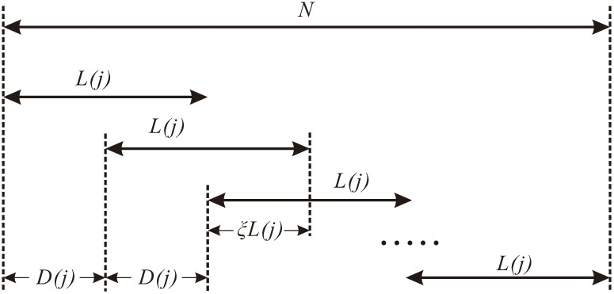

:orphan:

``iLPSD`` ：功率谱估计
--------------------------------------

``iLPSD`` 根据对数频率点功率谱估计算法进行功率谱估计。

使用说明
~~~~~~~~~~~~~~~~~~~~~~~~~~~~~~~~~~~~~

.. code-block::

    iLPSD(data,fs)
    iLPSD(data,fs,Name,Value)
    h = iLPSD(data,fs,_)
    [pxx,f] = iLPSD(data,fs,_)

- 输入
    - ``data`` --- 输入数据，向量或矩阵。当输入为矩阵时，对每列数据分别进行功率谱估计；
    - ``fs`` --- 采样率（\ :math:`\rm Hz`\ ），为标量。
- 键-值参数
    - ``Jdes`` --- 期望的频率点数，默认为 1000；
    - ``Kdes`` --- 期望的分段次数，默认为 100；
    - ``ksai`` --- 分段数据重叠率，默认为 0.5；
    - ``win`` --- 窗函数的函数句柄，默认为 ``@hann``。
    - 支持使用其他控制绘图的键值对，如 ``LineWidth`` 等。
- 输出
    - ``h`` --- 功率谱密度的曲线句柄，当且仅当函数只有一个输出时输出该变量；
    - ``pxx`` --- 单边功率谱密度（\ :math:`\rm *^2/Hz`\ ），当输入数据 ``data`` 为矩阵时， ``pxx`` 的每列对应输入数据每列的单边功率谱密度；
    - ``f`` --- 单边功率谱密度对应的频率点（\ :math:`\rm Hz`\ ）。

.. hint::
   若使用自定义窗函数，确保窗函数仅接受（窗长）一个参数输入，且输出的窗函数值为列向量。

-----

算法说明
~~~~~~~~~~~~~~~~~~~~~~~~~~~~~~~~~~~~~

LPSD（Logarithmic frequency axis Power Spectral Density）算法的基本思想是采用对数分布的频率点，由于此时频率点的差值不是定值，即 DFT 的频率分辨率随频率点变化，因而在求取每个频率点对应的功率谱密度时应当对原始数据进行不同的分段。这就是说，LPSD 算法的每个频率点对应于不同分段次数下 Welch 算法中的相应点。

对数频率的选取
^^^^^^^^^^^^^^^^^^^^^^^^^^^^^^^^^^^^^

记采集到的离散数据为 :math:`x(n),n=0,1,2...N-1` ，采样率为 :math:`f_s` 。假设希望计算 :math:`J_{\rm des}` 个点，其中第 :math:`j` 个点对应的频率为 :math:`f(j)` 、功率谱密度为 :math:`P(j)` 、频率分辨率为 :math:`r(j)=f(j+1)-f(j)` 。应当注意的是，这里的频率分辨率是指计算DFT的频率点之间的间隔，更一般的说法应当是栅栏效应。有限长数据的频率分辨率实际由DTFT定义，与数据的时间长度互为导数，本文中称之为最小分辨率。在LPSD算法中不能采用 ``logspace`` 生成对数分布的频率点，因为数值计算的频率间隔不应当小于最小分辨率 :math:`r_{\rm min}` ，否则这种计算是没有意义的。

.. figure:: figures/lpsd01.jpg
    :figwidth: 60%
    :align: center

为了计算频率点，首先考察严格对数均匀的频率点应当满足

.. math::
   \log f(j + 1) - \log f(j) = C

其中C为常数。频率范围受分辨率和采样率的影响，取

.. math::
   \begin{aligned}
     f(1) &= {r_{\rm min}} = \frac{{{f_s}}}{N} \\ 
     f({J_{\rm des}}) &= {f_{\rm max}} = \frac{{{f_s}}}{2} 
   \end{aligned}

再令

.. math::
   g=\log f_{\rm max}- \log r_{\rm min}=\log \frac{N}{2}

可以得到第 :math:`j` 个点的频率和频率分辨率分别为

.. math::
   \begin{aligned}
     f(j) &= {r_{\rm min}} \times {10^{\frac{{j - 1}}{{{J_{\rm des}} - 1}}g}} \\ 
     {r_0}(j) &= f(j)({10^{\frac{g}{{{J_{\rm des}} - 1}}}} - 1) 
   \end{aligned}

为了使低频段到高频段的频率分辨率变化较连续，对中频段对应的频率分辨率进行调整，为此，引入分段次数期望值 :math:`K_{\rm des}` （其典型值为100），在分段重叠率为 :math:`\xi` 时满足

.. math::
   ({K_{\rm des}} - 1)(1 - \xi ){L_{\rm avg}} + {L_{\rm avg}} = N

此时对应的频率分辨率为

.. math::
   r_{\rm avg}=\frac{f_s}{L_{\rm avg}}=\frac{f_s}{N}\left[ (K_{\rm des}-1)(1-\xi) +1 \right]

根据分辨率限制和算法需求，我们需要对频率分辨率进行调整，如下

.. math::
   r'(j) = \left\{ \begin{aligned}
        & r_0(j) &,&\quad r_0(j) \le r_{\rm avg} \\
        & \sqrt{r_0(j) \cdot r_{\rm avg}} &,&\quad r_0(j) < r_{\rm avg} \, \text{and} \, \sqrt{r_0(j) \cdot r_{\rm avg}} > r_{\rm min} \\
        & r_{\rm min} &,&\quad \text{else}
   \end{aligned} \right.

除此之外，为了保证依据频率分辨率分段的数据长度为整数，频率分辨率还应当做进一步调整

.. math::
     L(j) = \left\lfloor {\frac{{{f_s}}}{{r'(j)}}} \right\rfloor  \quad
     r(j) = \frac{{{f_s}}}{{L(j)}} 

其中，符号 :math:`\left\lfloor \right\rfloor` 表示向下取整。

综上所述，对数频率的选取算法为：以 :math:`f(1)=r_{\rm min}` 为起点，根据频率和 :math:`J_{\rm des}` 求解分辨率 :math:`r_0(j)` ，并根据要求对分辨率进行调整，得到 :math:`r(j)` ，接着利用 :math:`f(j+1)=f(j)+r(j)` 进行迭代。当计算的频率达到奈奎斯特频率即可停止迭代。值得注意的是，由于对频率分辨率进行了修正，获得的频率点并不是严格的对数分布，同时也会导致实际获得的频率点 :math:`J` 与期望的点数 :math:`J_{\rm des}` 并不相等。

数据的分段处理
^^^^^^^^^^^^^^^^^^^^^^^^^^^^^^^^^^^^^

对于第 :math:`j` 个频率点，由前可知其频率分辨率为 :math:`r(j)` ，分段后的每段数据长度为 :math:`L(j)` 。为了减小窗函数导致的数据不等权，允许分段之间存在一定的重叠率 :math:`\xi` ，数据分段如下图所示。

由图可知，每段数据未重叠部分长度为

.. math::
   D(j) = (1 - \xi ) \cdot L(j)

因而分段次数为

.. math::
   K(j) = \left\lfloor {\frac{N - L(j)} {D(j) + 1} } \right\rfloor 

针对每段数据，我们可以选择利用 ``mean`` 函数求取数据平均值后予以扣除，或利用 ``detrend`` 函数直接去除数据中线性漂移。以扣除平均值为例，第 :math:`j` 个频率点的第 :math:`k` 段数据平均值为

.. math::
   a(j,k) = \frac{1}{L(j)}\sum\limits_{l = 1}^{L(j)} {x\left( {D(j) \cdot (k - 1) + l} \right)}

将该段数据扣除平均值后，以相同长度的窗函数 :math:`w(j,l)` 对数据段进行加窗，得到预处理的数据段

.. math::
   G(j,k,l) = \left[ {x\left( {D(j) \cdot (k - 1) + l} \right) - a(j,k)} \right] \cdot w(j,l), \quad
   l = 1,2,3...L(j)

然后对 :math:`G(j,k,l)` 进行离散傅里叶变换

.. math::
   A(j,k) = \sum\limits_{l = 1}^{L(j)} G(j,k,l) \cdot e^{ - 2\pi i\frac{m(j)}{L(j)}l} 

应当注意的是 :math:`G(j,k,l)` 中 :math:`j` 表示频率点、 :math:`k` 表示分段、 :math:`l` 代表数据在分段内的位置，因此 :math:`l` 对应傅里叶变换的时间变量。严格来说，上式是离散傅里叶变换第 :math:`m(j)` 个点的值。其中

.. math::
   m(j)=\frac{f(j)}{r(j)}

在FFT算法中， :math:`m(j)` 应当是整数，而此处不一定满足该要求，故LPSD算法不能利用FFT进行加速，这是该算法耗时较长的原因之一。对 :math:`m(j)` 的具体讨论详见文献，此处不作赘述。

在进行以上操作后，我们得到了第 :math:`j` 个频率点对应的 :math:`K(j)` 段数据DFT的 :math:`K(j)` 个单点值，对这些值进行算数平均，根据Parseval等式可得谱密度为

.. math::
   P(j) = \frac{C}{K(j)}\sum\limits_{k = 1}^{K(j)} { { {\left| {A(j,k)} \right|}^2} } 

其中 :math:`C` 为归一化系数，由下一节进行讨论。

功率谱的归一化
^^^^^^^^^^^^^^^^^^^^^^^^^^^^^^^^^^^^^

功率谱的归一化系数与窗函数相关，而窗函数可根据不同需求进行不同的选择。对于任意窗函数 :math:`w(j,l)` ，做如下定义

.. math::
   \begin{aligned}
     {S_1}(j) &= \sum\limits_{l = 1}^{L(j)} {w(j,l)}  \\
     {S_2}(j) &= \sum\limits_{l = 1}^{L(j)} {{w^2}(j,l)}  
   \end{aligned}

单边谱的归一化系数可按下式进行计算

.. math::
   \begin{aligned}
     {C_{\rm PS}}(j) &= \frac{2}{{S_1^2(j)}} \\ 
     {C_{\rm PSD}}(j) &= \frac{2}{{{f_s} \cdot {S_2}(j)}} 
   \end{aligned}

其中， :math:`C_{\rm PS}` 是功率谱的归一化系数，常用于单频信号的处理。由于绝大多数信号都均匀丰富的频率成分，我们更多地采用功率谱密度，其对于的归一化系数为 :math:`C_{\rm PSD}` 。以电压为例，功率谱的单位是 :math:`{\rm V}^2` ，而功率谱密度的单位是 :math:`{\rm V}^2/{\rm Hz}` 。在习惯上，我们所说的功率谱指的都是功率谱密度，且取其开方值，单位为 :math:`{\rm V}/\sqrt{ {\rm Hz} }` 。

至此，功率谱估计完成，以 :math:`f(j)` 为横轴， :math:`P(j)` 为纵轴即可绘制功率谱密度曲线。

参考资料
~~~~~~~~~~~~~~~~~~~~~~~~~~~~~~~~~~~~~

#. \M. Tröbs and G. Heinzel, “Improved spectrum estimation from digitized time series on a logarithmic frequency axis,” Measurement, vol. 39, no. 2, pp. 120–129, Feb. 2006, doi: 10.1016/j.measurement.2005.10.010.
